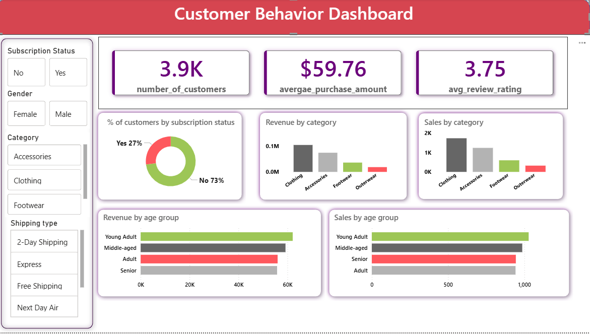

# 📊 Customer Behavior Dashboard (Power BI)

## 🔍 Overview
This project analyzes customer behavior, purchase patterns, and sales performance using Power BI.

## 📌 Key Metrics
- Total Customers: 3.9K  
- Average Purchase Amount: $59.76  
- Average Review Rating: 3.75  

## 📊 Key Insights
- Clothing category generates the highest revenue  
- Young adults contribute the most to sales  
- Only 27% customers are subscribed  

## 🛠 Tools Used
- Power BI  
- Data Visualization  

## 📷 Dashboard Preview

## 📁 Files
- Power BI file (.pbix)
- Dashboard image

## 🚀 Conclusion
This dashboard helps in understanding customer trends and identifying business growth opportunities.
